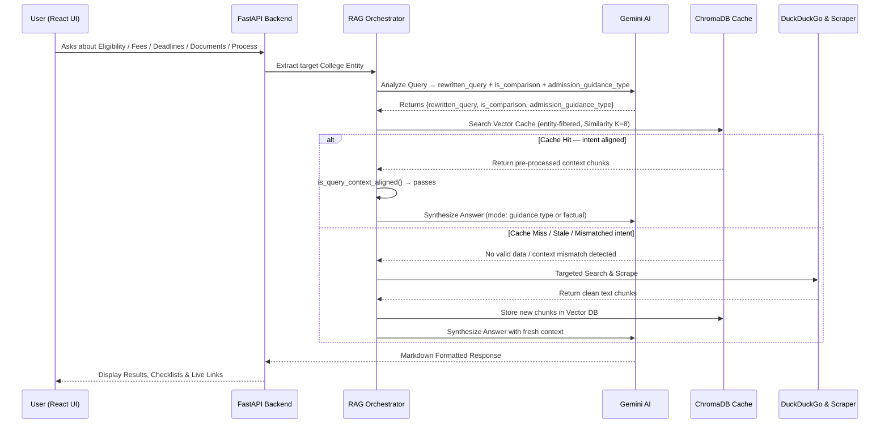
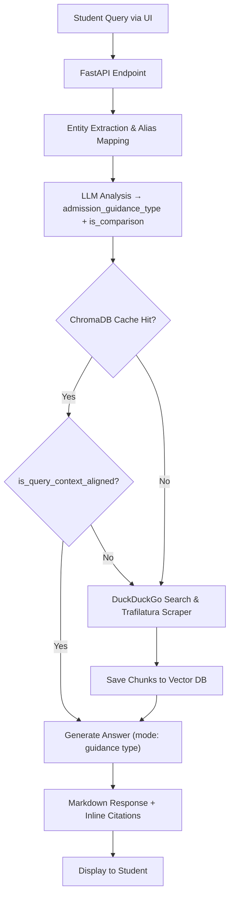

# Admission Assistant AI 🎓

A full-stack, real-time Retrieval-Augmented Generation (RAG) platform that provides guidance on college admissions by dynamically answering questions on eligibility, required documents, deadlines, fees, and offering a step-by-step checklist.

## Features

- **Intelligent Admission Guidance**: Delivers precise answers related to college eligibility criteria, required documents, application deadlines, fees, and admission processes.
- **Guidance-Type Classification**: Every query is automatically classified into one of five categories — `eligibility`, `documents`, `deadlines`, `process`, or `fees` — so the LLM always generates a response formatted to match exactly what the student asked.
- **Intent-Aware Cache Validation**: Before serving cached results, the system verifies the cached context actually aligns with the query's topic (e.g., ranking data is never served for a fees query), preventing silent cache misuse.
- **Step-by-Step Checklists**: Automatically synthesizes structured, easy-to-follow checklists for prospective students based on targeted college requirements.
- **Real-Time Web Scraping**: Dynamically fetches and extracts up-to-date admission procedures from university web pages using `trafilatura` and DuckDuckGo search.
- **Smart RAG Pipeline**: Uses ChromaDB for vector caching with entity-aware searching to prevent cross-contamination when querying different colleges.
- **FastAPI Backend**: A highly modular REST API architecture designed for concurrency and fast response times.
- **React + Vite Frontend**: A fast, responsive user interface designed for a seamless student experience.

## Why We Chose These Technologies

- **FastAPI (Backend)**: College admission questions require rapid, asynchronous handling of web scraping and LLM generation simultaneously. FastAPI's native `asyncio` support guarantees extremely fast, non-blocking performance.
- **React + Vite (Frontend)**: React effortlessly handles dynamic state updates for our chats, while Vite provides instant hot-module-reloading and lightning-fast production builds, ensuring a snappy student user experience.
- **Google Gemini AI (LLM)**: Gemini proved exceptionally skilled at taking long, unstructured scraped paragraphs and synthesizing them directly into highly accurate, structured markdown step-by-step checklists.
- **ChromaDB (Vector Database)**: We needed a fast, lightweight, and local vector cache. ChromaDB allows us to perform precise "Similarity Searches" instantly without the strict overhead or privacy concerns of an external database.
- **Ollama (Embeddings)**: Used to generate textual embeddings 100% locally. This keeps the application highly cost-effective, bypassing the need to pay for tokenized external embedding APIs.
- **Trafilatura & DuckDuckGo**: Instead of manually maintaining hardcoded data for hundreds of colleges, DuckDuckGo acts as an agile gateway to the live internet. Trafilatura dynamically strips away website menus, footers, and ads to yield clean text specifically for the LLM context.

## Architecture Overview

The system employs an advanced Retrieval-Augmented Generation (RAG) architecture. When a student asks about a specific college, the backend first classifies the query into a guidance type (`eligibility`, `documents`, `deadlines`, `process`, or `fees`). It then attempts to answer using a local vector database (ChromaDB), but only if the cached context is verified to be aligned with the query's topic. If the context is missing, stale, or mismatched, the system falls back to live web scraping. The extracted data is ingested, vectorized using Ollama, and cached before Google Gemini synthesizes the final response in the appropriate format (structured guide, comparison table, or concise factual answer) and cites its sources.

### Architecture Diagram



### Flow Diagram



## Setup Steps

### 1. Backend Setup (Python)
Navigate to the `backend` directory and set up the virtual Python environment:
```bash
cd backend
python -m venv .venv

# Activate (Windows)
.venv\Scripts\activate
# Activate (Mac/Linux)
source .venv/bin/activate

# Install dependencies
pip install -r requirements.txt
```

### 2. Configure Credentials
Inside the `backend/` folder, create and modify the `.env` file to insert your Google Gemini API key:
```env
GOOGLE_API_KEY="your_google_gemini_api_key_here"
```

### 3. Frontend Setup (React & Vite)
Open a new terminal window, navigate to the frontend directory, and install the modules:
```bash
cd frontend
npm install
```

## Usage Instructions

To run the full application, start both the backend and frontend servers simultaneously.

### 1. Start the FastAPI Backend
Execute this inside the `backend/` directory with your virtual environment activated:
```bash
python -m uvicorn app.server:app --reload --host 0.0.0.0 --port 8000
```
*Note: You can inspect your ChromaDB cache limit locally by running `python app/main.py inspect`*

### 2. Start the Frontend Application
Execute this inside the `frontend/` directory in a separate terminal:
```bash
npm run dev
```
Navigate to your local URL (e.g., `http://localhost:5173`) in your web browser.

### 3. CLI Testing (Optional)
You can test the RAG pipeline directly from the terminal without using the UI:
```bash
cd backend
python app/main.py query "What are the required documents and application deadlines for MIT?"
```