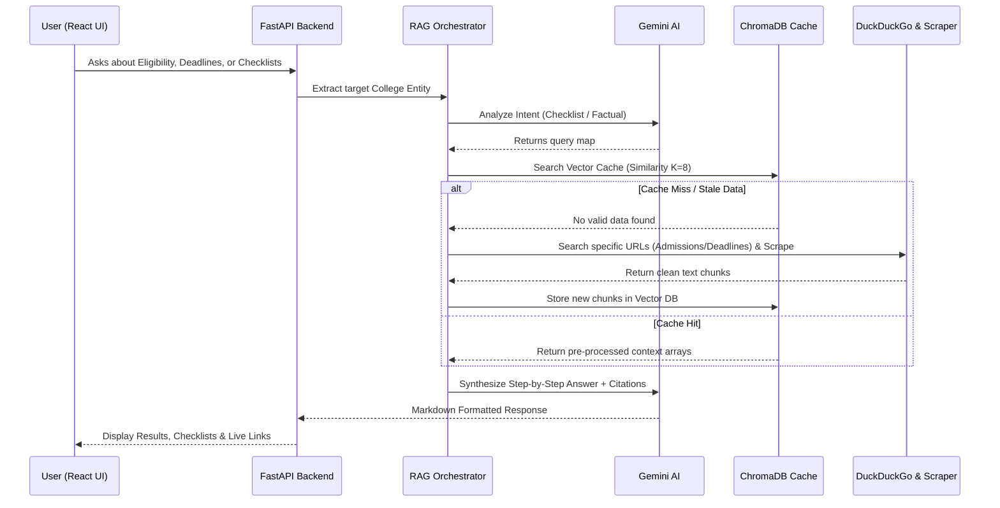
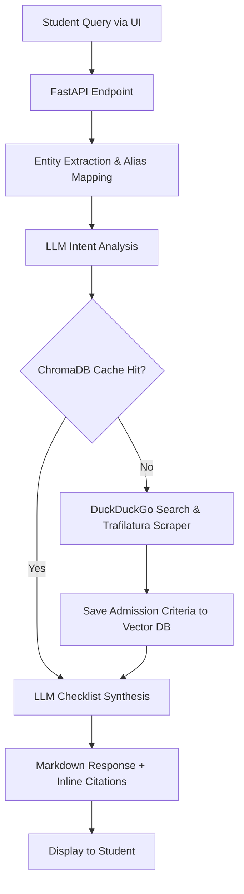

# Admission Assistant AI 🎓

A full-stack, real-time Retrieval-Augmented Generation (RAG) platform that provides guidance on college admissions by dynamically answering questions on eligibility, required documents, and deadlines, along with offering a step-by-step checklist.

## Features

- **Intelligent Admission Guidance**: Delivers precise answers related to college eligibility criteria, required documents, application deadlines, and admission processes.
- **Step-by-Step Checklists**: Automatically synthesizes structured, easy-to-follow checklists for prospective students based on targeted college requirements.
- **Real-Time Web Scraping**: Dynamically fetches and extracts up-to-date admission procedures from university web pages using `trafilatura` and DuckDuckGo search.
- **Smart RAG Pipeline**: Uses ChromaDB for vector caching with entity-aware searching to prevent cross-contamination when querying different colleges.
- **FastAPI Backend**: A highly modular REST API architecture designed for concurrency and fast response times.
- **React + Vite Frontend**: A fast, responsive user interface designed for a seamless student experience.

## Architecture Overview

The system employs an advanced Retrieval-Augmented Generation (RAG) architecture. When a student asks about a specific college's admission process, the backend attempts to answer using a local vector database (ChromaDB). If the specific data is missing or stale, the system falls back to live web scraping. The extracted data is ingested, vectorized using Ollama, and cached before a generative AI (Google Gemini) synthesizes the final step-by-step response and cites its sources.

### Architecture Diagram



### Flow Diagram



## Setup Steps

### 1. Backend Setup (Python)
Navigate to the `backend` directory and set up the virtual Python environment:
```bash
cd backend
python -m venv .venv

# Activate (Windows)
.venv\Scripts\activate
# Activate (Mac/Linux)
source .venv/bin/activate

# Install dependencies
pip install -r requirements.txt
```

### 2. Configure Credentials
Inside the `backend/` folder, create and modify the `.env` file to insert your Google Gemini API key:
```env
GOOGLE_API_KEY="your_google_gemini_api_key_here"
```

### 3. Frontend Setup (React & Vite)
Open a new terminal window, navigate to the frontend directory, and install the modules:
```bash
cd frontend
npm install
```

## Usage Instructions

To run the full application, start both the backend and frontend servers simultaneously.

### 1. Start the FastAPI Backend
Execute this inside the `backend/` directory with your virtual environment activated:
```bash
python -m uvicorn app.server:app --reload --host 0.0.0.0 --port 8000
```
*Note: You can inspect your ChromaDB cache limit locally by running `python app/main.py inspect`*

### 2. Start the Frontend Application
Execute this inside the `frontend/` directory in a separate terminal:
```bash
npm run dev
```
Navigate to your local URL (e.g., `http://localhost:5173`) in your web browser.

### 3. CLI Testing (Optional)
You can test the RAG pipeline directly from the terminal without using the UI:
```bash
cd backend
python app/main.py query "What are the required documents and application deadlines for MIT?"
```