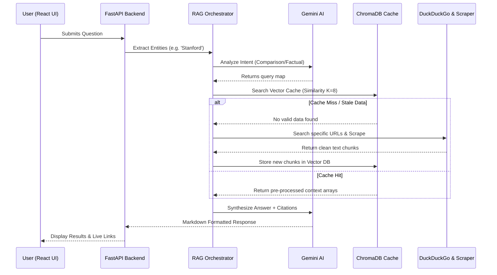
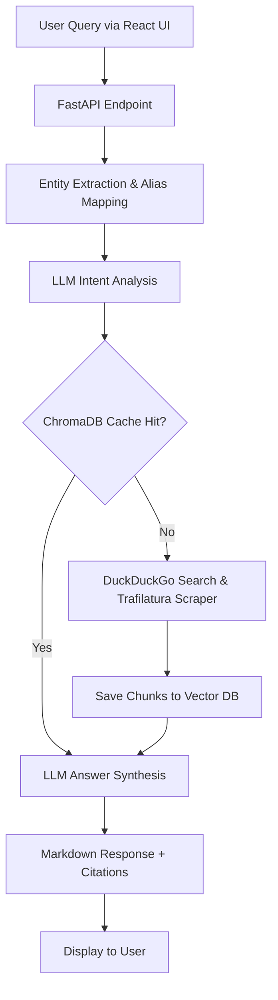

# CollegeIQ - Admission Information System 🎓

A full-stack, real-time Retrieval-Augmented Generation (RAG) platform that scapes college websites dynamically to answer queries regarding admissions, fees, and rankings using Google Gemini AI.

## Features

- **Real-Time Web Scraping**: Dynamically fetches and extracts clean content from university web pages using `trafilatura`.
- **Intelligent RAG Pipeline**: Uses ChromaDB for vector caching with entity-aware searching to prevent cross-contamination of multi-college queries.
- **Comparison Engine**: Supports multi-college ranking and fee comparisons dynamically generated via LLM intent analysis.
- **FastAPI Backend**: A highly modular REST API architecture designed for concurrency and speed.
- **React + Vite Frontend**: A fast, responsive user interface with session tracking and intuitive result presentation.

## Project Structure

```text
admission_assistant_ai_mini_project/
├── backend/
│   ├── app/
│   │   ├── api/            # FastAPI router and schema definitions
│   │   ├── core/           # RAG architecture, LLM settings, Entity Extraction
│   │   ├── services/       # LLM synthesis, ChromaDB vector caching, Web scraping
│   │   ├── main.py         # CLI entrypoint for testing
│   │   └── server.py       # FastAPI uvicorn application entrypoint
│   ├── .env                # Environment secrets (Google Gemini API)
│   └── requirements.txt    # Python backend dependencies
├── frontend/
│   ├── src/                # React App UI components and logic
│   ├── package.json        # Node.js dependencies
│   └── vite.config.js      # Vite build configuration
└── README.md
```

## Installation

### 1. Backend Setup (Python)
Navigate to the `backend` directory and set up the virtual Python environment:
```bash
cd backend
python -m venv .venv

# Activate (Windows)
.venv\Scripts\activate
# Activate (Mac/Linux)
source .venv/bin/activate

# Install dependencies
pip install -r requirements.txt
```

### 2. Configure Credentials
Inside the `backend/` folder, create and modify the `.env` file to insert your Google Gemini API key:
```env
GOOGLE_API_KEY="your_google_gemini_api_key_here"
```

### 3. Frontend Setup (React & Vite)
Open a new terminal window, navigate to the frontend directory, and install the modules:
```bash
cd frontend
npm install
```

## Usage

To run the full application, start both the backend and frontend servers simultaneously.

### 1. Start the FastAPI Backend
Execute this inside the `backend/` directory:
```bash
python -m uvicorn app.server:app --reload --host 0.0.0.0 --port 8000
```

### 2. Start the Frontend Application
Execute this inside the `frontend/` directory in a separate terminal:
```bash
npm run dev
```
Navigate to the local URL (e.g., `http://localhost:5173`) in your web browser.

### Optional: CLI Pipeline Testing
You can interact with the RAG pipeline directly from the terminal if you don't want to use the UI:
```bash
cd backend
python app/main.py query "What are the latest application deadlines for Stanford versus MIT?"
```

## Architecture & Data Flow



### System Pipeline (Flowchart)



### Flow Breakdown:
1. **Entity Extraction**: The user query is passed through a regex-based alias normaliser to standardise college names.
2. **Intent Analysis**: The LLM evaluates user intent (`factual`, `process`, or `comparison`).
3. **Smart Cache Lookup**: ChromaDB is searched locally. If the specific college's data is present and its cosine distance reflects accuracy, it prevents repetitive scraping.
4. **Live Scrape (Fallback)**: If context is missing, the system utilizes DuckDuckGo logic to locate up to 5 specific URLs. The application cleanly parses text sequentially using `trafilatura`.
5. **Generative Synthesis**: The LLM generates a structured markdown response infused with inline numbered source citations.